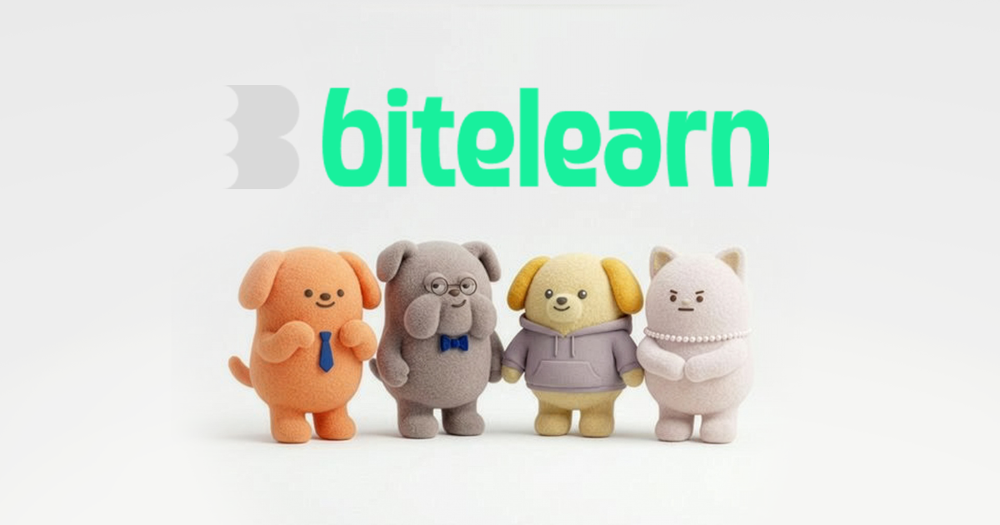

# bitelearn



사회초년생을 위한 계약 지식 학습 서비스입니다.  
부동산, 생활금융, 세무, 투자 같은 실생활 주제를 퀴즈와 아티클로 쉽고 가볍게 학습할 수 있도록 구성했습니다.

## Overview

- 한 입 분량의 학습 경험: 단어 학습, 지문, 퀴즈, 결과 화면까지 짧은 흐름으로 설계했습니다.
- 실생활 중심 주제: 부동산 · 주거, 생활금융 · 고용, 커리어 · 세무, 자산운용 · 투자 카테고리를 제공합니다.
- 학습과 읽기의 연결: 퀴즈형 학습으로 핵심을 익히고, 더 자세한 내용은 아티클로 확장해 볼 수 있습니다.
- 개인화 경험: 로그인 사용자 기준으로 최근 학습, 레벨, 오답노트, 북마크를 관리합니다.

## Project Info

- 개발 기간: 2026.02.24 - 2026.03.26
- 배포 사이트: https://bitelearn.site
- 팀 구성: FE 1명, BE 1명, PD 2명, PM 3명

## Key Features

### 1. 대시보드

- 비회원/회원 상태에 따라 다른 히어로 섹션을 보여줍니다.
- 오늘의 추천 학습과 유용한 아티클을 홈에서 바로 탐색할 수 있습니다.

### 2. 학습 로드맵

- 카테고리 > 토픽 > 챕터 흐름으로 학습 경로를 제공합니다.
- 단어 카드, 지문 보기, 객관식/OX/문서형 퀴즈, 결과 화면까지 이어지는 학습 플레이어를 포함합니다.

### 3. 아티클

- 대표 아티클과 카드 목록을 제공합니다.
- 상세 페이지에서 요약, 본문, 공유 기능을 확인할 수 있습니다.

### 4. 노트

- 오답노트를 카테고리별로 필터링해 복습할 수 있습니다.
- 북마크한 아티클을 별도 탭에서 모아볼 수 있습니다.

### 5. 인증 및 마이페이지

- 이메일 로그인/회원가입과 Google, Naver 소셜 로그인 진입점을 제공합니다.
- 닉네임 수정, 로그아웃, 이용약관/개인정보처리방침 링크를 지원합니다.

## Tech Stack


## Project Structure

```text
src/
  api/                API 통신, 인증, 학습/노트 쿼리
  assets/             브랜드, 캐릭터, 카테고리, 아티클 이미지
  components/
    common/           공통 레이아웃/헤더/푸터/SEO
    features/         도메인별 UI 컴포넌트
    ui/               재사용 가능한 베이스 UI
  constants/          서비스 상수, 학습 메타데이터, 약관 링크
  hooks/              북마크, 그림자, URL 파라미터 등 커스텀 훅
  layouts/            루트/앱 레이아웃
  lib/                SEO, 에러 로깅, 학습 네비게이션 유틸
  mock/               대시보드, 학습, 아티클 목업 데이터
  pages/              라우트 단위 페이지
  router/             전체 라우팅 정의
  schemas/            폼 검증 스키마
  utils/              포맷팅 유틸
```

## Routing

- `/` : 홈 대시보드
- `/learning` : 학습 카테고리
- `/learning/:categoryId/topics/:topicId` : 학습 로드맵
- `/learning/:categoryId/:chapterId` : 학습 진행
- `/articles` : 아티클 목록
- `/articles/:articleId` : 아티클 상세
- `/notes` : 오답노트 / 북마크
- `/mypage` : 마이페이지
- `/login`, `/signup/terms`, `/signup` : 인증 관련 페이지

## Getting Started

```bash
# 프로젝트 의존성 설치
npm install

# 개발 서버 실행
npm run dev
```

## Current Status

- 현재 프로젝트는 일부 화면에서 실제 API와 `mock` 데이터를 함께 사용합니다.
- 인증, 학습 카테고리/챕터, 오답노트는 API 연동 구조를 기준으로 작성되어 있습니다.
- 실제 학습 진행은 부동산 카테고리의 월세 토픽 챕터 1, 2 데이터까지만 연결되어 있어 해당 범위에서만 플레이할 수 있습니다.
- 오답노트는 복습용 조회와 문제 확인 중심으로 구현되어 있으며, 재풀이 기능은 아직 지원하지 않습니다.

## Next Steps

- 실제 API 기반 아티클 목록/상세 데이터 연동
- 추천 학습과 대시보드 데이터 개인화 고도화
- 액세스 토큰 검증 및 인증 예외 처리 로직 보강
- FAQ, 공지사항, 비밀번호 변경 등 마이페이지 미구현 기능 확장
- 온보딩 이후 사용자 맞춤 학습 흐름 개선
